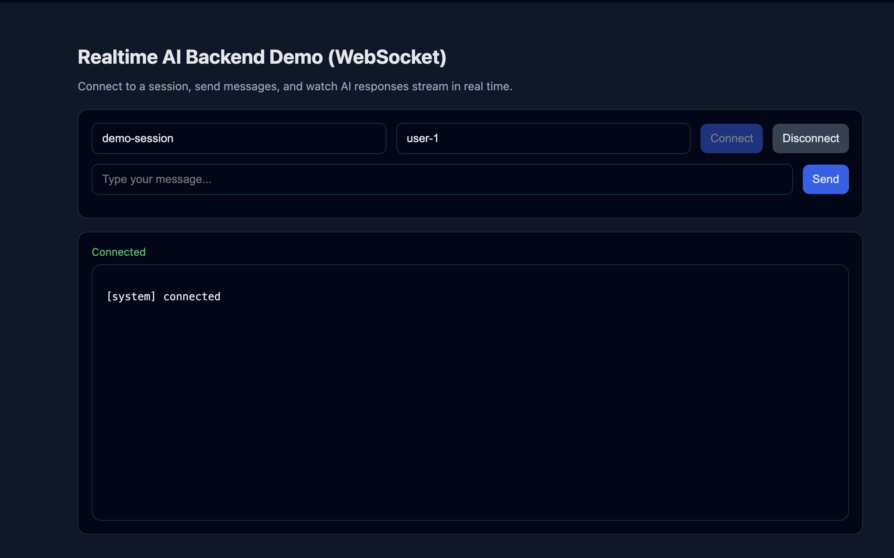
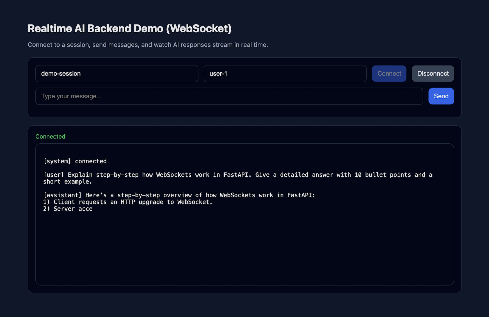
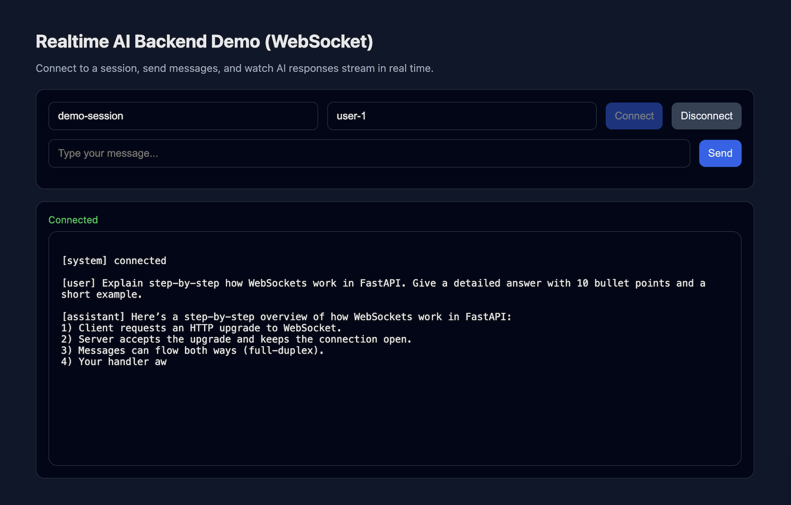
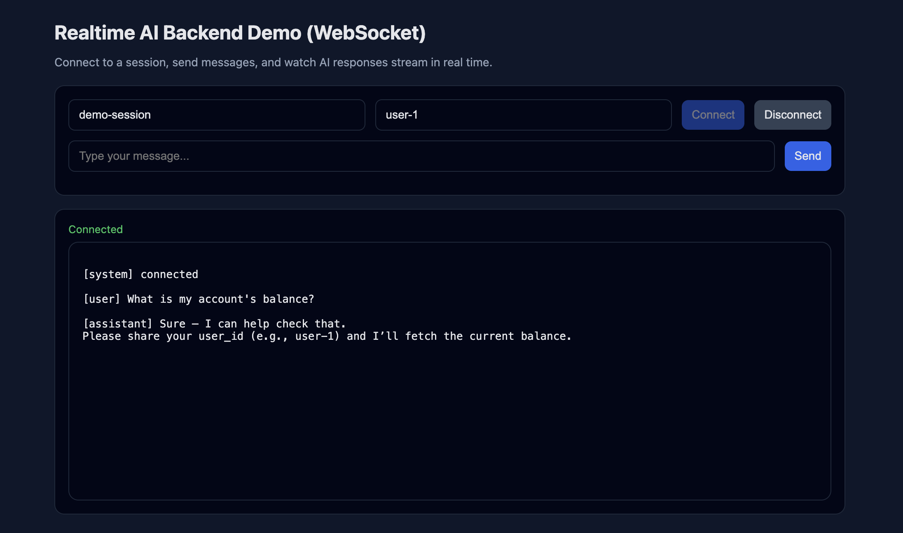

# Tecnvi Realtime AI Backend
**WebSockets • LLM Streaming • Supabase Persistence**

This repository implements the assignment **“Realtime AI Backend (WebSockets + Supabase)”** using **FastAPI**, **WebSockets**, and **Supabase Postgres**.

The system demonstrates real-time AI response streaming, complex multi-step interaction patterns, persistent session storage, and post-session AI processing.

---

## Key Features

- **Realtime bi-directional WebSocket sessions**  
  Endpoint: `/ws/session/{session_id}`

- **Token-level streaming**  
  AI responses are streamed incrementally to simulate low-latency LLM output.

- **Complex LLM interaction patterns**
  - Multi-turn conversation state management
  - Tool / function-calling architecture (simulated internal tools)
  - Conditional follow-up questions when required parameters are missing

- **Supabase Postgres persistence**
  - Session metadata table
  - Detailed chronological event log

- **Post-session processing**
  - On WebSocket disconnect, an asynchronous job analyzes the conversation
  - Generates a concise session summary
  - Persists end time, duration, and summary

- **Lightweight frontend**
  - Simple HTML/CSS/JavaScript UI
  - Focused on WebSocket connectivity and streaming (UI/UX intentionally minimal)

---

## LLM Usage

### Mock Mode (Default)
Runs without external APIs if `OPENAI_API_KEY` is not set.

### Real LLM Mode (Optional)
Uses a real LLM for streaming, tool calling, and summarization when `OPENAI_API_KEY` is provided.

---

## Setup

### Requirements
- Python **3.11+**
- Supabase Postgres project
- Optional OpenAI API key

### Install
```bash
pip install -r requirements.txt
```

---

## Run Locally
```bash
uvicorn app.main:app --reload --host 0.0.0.0 --port 8000
```

- API: http://localhost:8000  
- Demo: http://localhost:8000/demo

---

## Deployment (Render)

**Live Demo**
- https://realtime-ai-backend-websockets-supabase.onrender.com/demo

**WebSocket Endpoint**
```
wss://realtime-ai-backend-websockets-supabase.onrender.com/ws/session/{session_id}
```

**Render Settings**
- Build: `pip install -r requirements.txt`
- Start: `uvicorn app.main:app --host 0.0.0.0 --port $PORT`
- Python: 3.11 (runtime.txt)

---

## Repository Structure
```
app/
frontend/
schema.sql
requirements.txt
runtime.txt
.env.example
README.md
```

---

## Screenshots (Working Proof)

### 1. WebSocket Session Connected
Demonstrates a live WebSocket session established with a unique `session_id` and `user_id`.



---

### 2. Token Streaming (Mid-Response)
Shows the assistant response arriving **incrementally**, proving real-time token streaming over WebSocket.



---

### 3. Token Streaming (Continued)
Additional proof of streaming behavior across longer responses.



---

### 4. Tool / Function Calling
Demonstrates complex LLM interaction where the assistant triggers an internal tool
(e.g., account balance or order status retrieval) before responding.



---

## Security
Environment variables must be set in deployment platform. `.env` is not committed.
